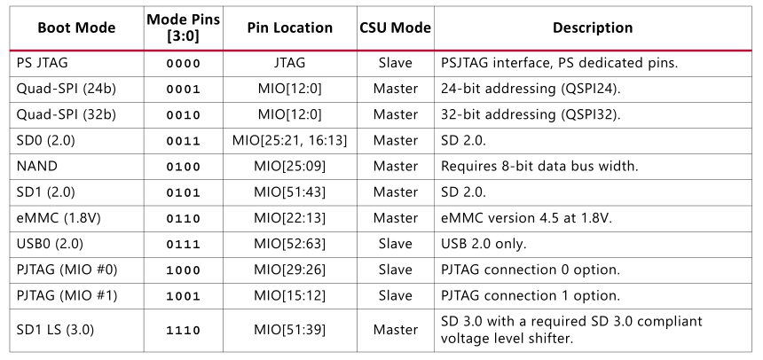
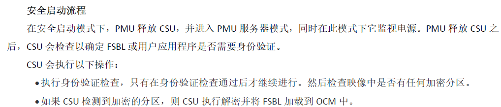
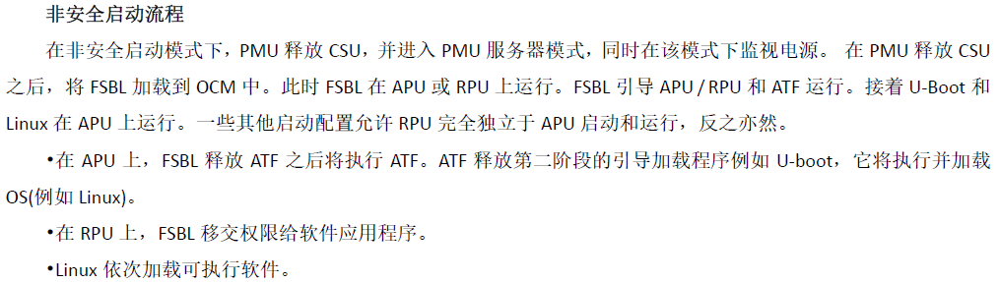
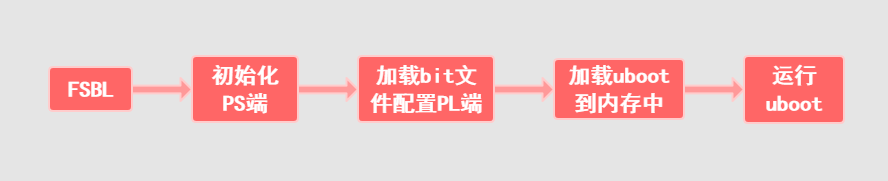

# 0-ZYNQ折腾记录-启动顺序
BootROM——>FSBL——>Uboot
----------------------

### BootROM

　　每次一上电， ARM核心就会前往 BootROM完成一些基本的准备工作， 就这样一个最开始的程序，需要完成以下几件事情：
*   释放PMU，复位CSU。
*   读取拨码开关，获取启动模式，从相应的内存中获取启动文件。
*   从Boot image里面获取Boot Header信息。
　　通过拨码开关调整ZYNQ用不同的Boot模式进行启动，ARM核心就会去对应的BootROM启动，包括JTAG、Flash、SD、eMMC等等。
​​
　　在ZYNQ的安全启动中，安全引导通常为BOOT.bin文件，系统加在BOOT.bin之后执行FSBL负责配置UBOOT和Linux内核，在加载过程中FSBL会验证所加载文件的完整性和安全性。
​​
　　在ZYNQ的非安全启动中，跳过BOOT.bin，直接使用FSBL和对应的app.bin进行开发，开发人员只需要通过调整app.bin即可快速验证程序，无需执行签名过程。
​​
### FSBL(First Stage Boot Loader)
　　FSBL的任务比较重要，它需要完成以下的工作：
*   初始化PS端。
*   使用bit文件配置PL端。
*   加载Uboot到内存中。
*   移交执行权限给Uboot。
​​
　　首先会初始化PS端的内存与MIO接口等然后读取 bit文件配置好PL端， 值得注意的是PL端需要在FSBL的阶段配置好，否则是无法直接配置的。接着加载Uboot到内存中，最后ARM会跳转到内存中执行Uboot程序。
### Uboot
　　Uboot最主要的功能就是将内核写入内存中， 然后将 执行权限移交给内核 ，但是 Uboot需要完成的任务并不仅限于此：
初始化运行环境。
*   初始化内存。
*   检查内存映射。
*   将内核写入内存。
*   设置启动参数。
*   调用内核。
　　等内核起来后，Uboot就完成了它的工作，紧接着就是内核去完成自己的工作。
