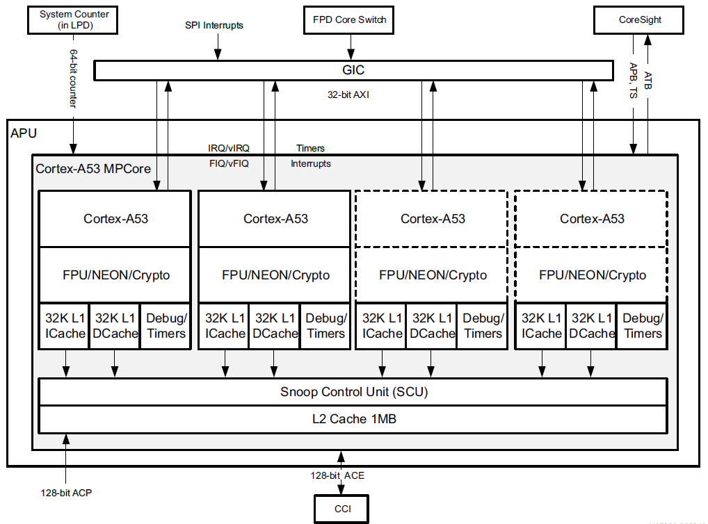
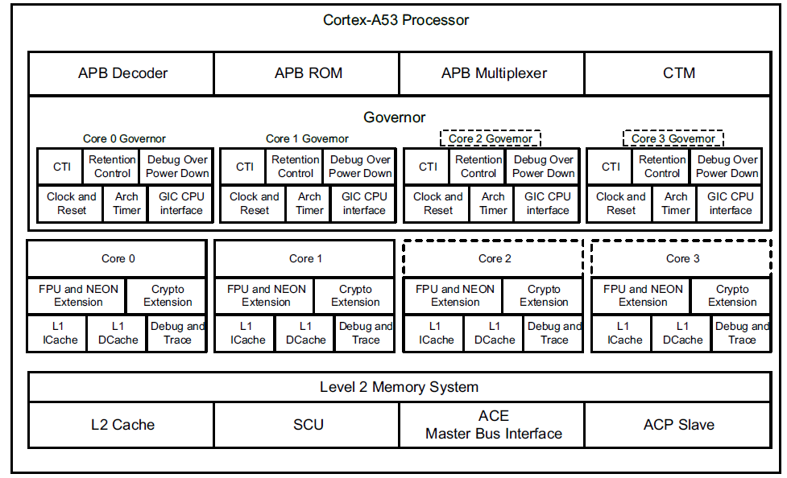

# 1-ZYNQ折腾记录-APU
　　应用程序处理单元(Application processing units, APU)由四个Cortex-M-A53 MPCore处理器、L2高速缓存和相关功能组成。Cortex-A53 MP Core处理器是最低功耗的Arm v8处理器，能够无缝支持 32位和64位代码。它利用高效的8阶段有序流水线，结合先进的取指和数据访问技术，以实现高性能。它适合用于入门级设备的功率和面积足迹，同时能够在使用高核心密度的可扩展企业级系统中提供高聚合性能。

​​

​​

APU Functional Units APU功能
--------------------------

### Instruction Fetch Unit 指令获取单元

　　指令获取单元(instruction fetch unit, IFU)包含指令高速缓存控制器及其相关的线填充缓冲区。Cortex-A53 MP Core指令高速缓存是双向集关联的，并使用虚拟索引物理标记(Virtually Indexed Physically Tagged, VIPT)高速缓存行，最多可存储16个A32指令、16个32位T32指令、16个A64指令，或最多32个16位T32指令。

　　IFU从指令缓存或外部存储器中获取指令，并预测指令流中分支的结果，然后将指令传递给数据处理单元(Data Processing Unit, DPU)进行处理。

### Data Processing Unit 数据处理单元

　　DPU持有大多数程序可见的处理器状态，例如通用寄存器数据处理单元和系统寄存器。它提供内存系统及其相关功能的配置和控制。根据Arm v8-A体系结构，在操作寄存器中持有的数据时，解码并执行指令。指令从IFU馈送到DPU。DPU通过接口执行需要将数据从内存系统传输到或从内存系统传输的指令，该接口管理所有加载和存储操作。

### Advanced SIMD and Floating-point Extension 高级SIMD和浮点扩展

　　先进的SIMD和浮点扩展实现Arm NEON技术;一种媒体和信号处理体系结构，增加了针对音频、视频、3D图形、图像和语音处理的指令。先进的SIMD指令可在AArch64和AArch32状态下使用。

### Cryptography Extension 密码学扩展

　　该加密扩展支持Arm v8加密扩展。该加密拓展为高级SIMD添加了新的A64、A32和T32指令，加速了以下操作。

*   高级加密标准(Advanced encryption standard, AES)加密和解密。
*   安全哈希算法(Secure-hash algorithm, SHA)功能是SHA-1、SHA-224和SHA-256。
*   在伽洛瓦/逆模式和椭圆曲线密码等算法中使用的有限域算法。

### Translation Lookaside Buffer 传输旁路缓冲区

　　传输旁路缓冲区(Translation Lookaside Buffer, TLB)包含主TLB，并处理处理器的所有翻译表行操作。TLB条目存储在一个512条目、4向集合关联的RAM中。

### Data-side Memory System 数据端存储系统

　　数据缓存单元(Data Cache Unit, DCU)由以下子块组成。

*   1级(L1)数据缓存控制器，为相关的嵌入式标签、数据和脏RAM生成控制信号，并在请求访问内存资源的各个源之间进行仲裁。数据缓存是4路集关联的，并使用物理索引物理标记(PIPT)方案进行查找，从而在系统中实现无歧义地址管理。
*   与DPU和主TLB接口的负载/存储管道。
*   系统控制器，通过与IFU的接口直接在数据缓存和指令缓存上执行缓存和TLB维护操作。
*   一个接收来自窥测控制单元(SCU)的一致性请求的接口。

#### Store Buffer 存储缓冲区

　　当存储操作离开加载/存储流水线并由DPU提交时，存储缓冲区(Store Buffer, STB)持有存储操作。STB可以请求访问DCU中的缓存RAM，请求BIU启动linefills，或请求BIU将数据写入外部写入通道。外部数据写入通过SCU进行。STB可以合并以下内容。

*   如果多个存储事务位于相同的128位对齐地址，则将它们合并为一个事务。
*   在AXI或CHI写入突发事件中进行多次写入。STB还用于在将维护操作广播到Cortex-A53 MPCore CPU集群中的其他核心之前，对这些操作进行排队。

　　Cortex-A53 MPCoreL1内存系统由独立的L1指令和数据缓存组成，还包括两个级别的TLB。

*   为指令和数据两侧分别设置微型TLB。
*   统一主TLB，处理来自微TLB的错误。

#### Bus Interface Unit and SCU Interface 总线接口单元与SCU接口

　　总线接口单元(Bus Interface Unit, BIU)包含SCU的接口和缓冲区，以将接口与缓存和STB解耦。BIU接口和SCU始终在处理器频率下运行。

#### Snoop Control Unit 窥探控制单元

　　窥探控制单元(SCU)将APU MP Core与Zynq UltraScale+ MPSoC中使用的加速器一致性端口(ACP)连接起来。SCU还拥有用于一致性支持的L1数据缓存标签的副本。SCU与处理器同步运行，运行频率相同。SCU包含缓冲区，可以处理处理器之间的直接缓存到缓存传输，而无需向外部存储器系统读取或写入任何数据。缓存行迁移使脏缓存行可以在处理器之间移动，并且不需要将传输的缓存行数据写回外部存储器系统。Cortex-A53 MP Core处理器使用 MOESI协议来维护多个核心之间的数据一致性。

### L2 Memory Subsystem L2内存子系统

　　Cortex-A53 MPCore处理器的L2内存系统大小为1MB。它包含L2缓存管道和所有逻辑，以维护集群核心之间的内存一致性。它具有以下功能:

*   SCU通过主存储器接口将内核连接到外部存储器系统。SCU维护APU MPCore之间的数据缓存一致性，并仲裁内核的L2请求。
*   L2缓存是16路集合关联的物理地址。
*   L2缓存标签与SCU重复标签并行查找。如果L2标签和SCU重复标签都命中，则读取访问L2缓存，而不是窥探其他处理器之一。

### Cache Protection 缓存保护

　　Cortex-A53 MP Core处理器使用两个独立的保护选项，支持以ECC形式对处理器中的RAM实例进行缓存保护。

*   SCU-L2缓存保护
*   CPU缓存保护

　　这些选项使Cortex-A53 MP Core处理器能够检测并纠正任何RAM中的1位错误，并检测某些RAM中的2位错误。Cortex-A53 MP Core RAMs受到单事件翻转(Southeast University)的保护，因此处理器系统可以检测并继续进行，而不会发生数据损坏。一些 RAM 具有奇偶校验单错误检测(Single Error Detect, SED)功能，而其他RAM具有ECC单错误纠正、双错误检测(Single Error Correct Double Error Detect, SECDED)功能。

　　当任何RAM中出现单比特错误时，处理器可以取得进展并保持功能正确。如果在多个RAM中出现多个单比特错误，或者在同一个RAM中的不同保护粒度内出现单比特错误，则处理器仍然保持功能正确。如果在同一个保护粒度内的单个RAM中出现双比特错误，则行为取决于RAM。

*   对于具有ECC功能的RAM，如果错误位于包含脏数据的缓存行中，则会检测并报告错误。
*   对于只有奇偶数的RAM，不会检测到双位错误，因此可能会导致数据损坏。

　　错误事件中断允许系统采取适当行动，包括清空和重新加载缓存，记录错误等。通过适当的交错、选择ECC和奇偶校验编码可以避免多比特干扰(MBU)。

### Debug and Trace 调试和跟踪

　　Cortex-A53 MP Core 处理器支持一系列调试和跟踪功能，包括以下功能。

*   每个核心中的Arm v8调试功能。
*   每个核心的 ETMv4 指令跟踪单元。
*   CoreSightTM 跨触点接口(CTI)
*   CoreSight交叉触发矩阵(CTM)
*   调试ROM。

### Generic Interrupt Controller 通用中断控制器

　　Cortex-A53 MPCore使用外部通用中断控制器GIC-400来支持中断。它是GICv2的实现，并提供硬件虚拟化的支持。

### Timers 定时器

　　Cortex-A53 MP Core处理器实现Arm通用计时器架构。

　　‍
