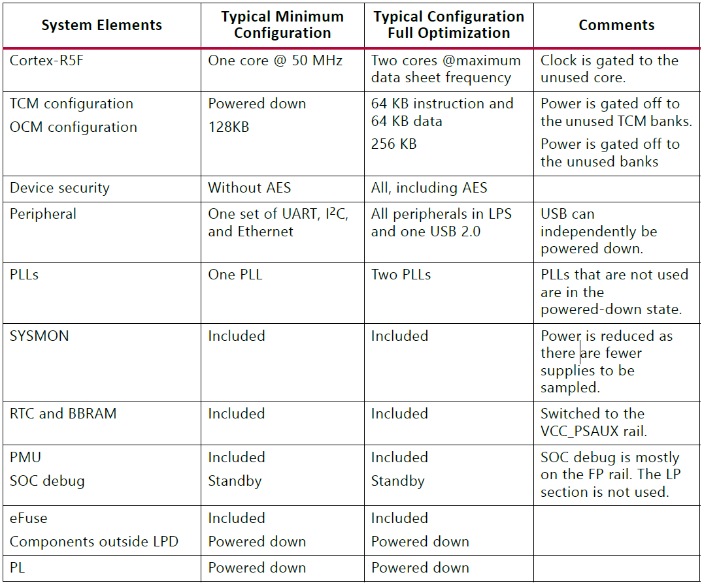
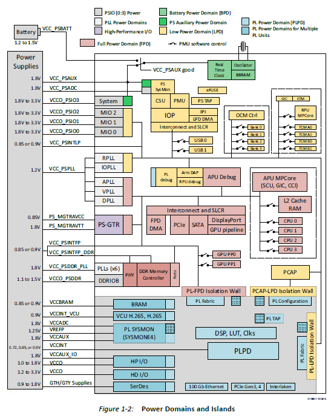
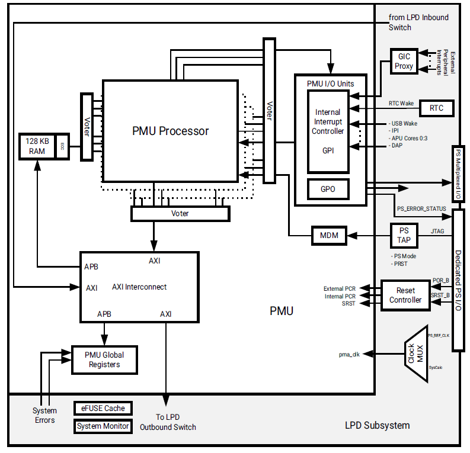

# 2-ZYNQ折腾记录-PMU
　　The AMD Zyng UltraScale+ MPSoC包括一个专用的用户可编程处理器，该平台测量单元(Platform Measurement Unit, PMU)处理器用于电源、错误管理和执行可选的软件测试库(Software Test Library, STL)用于功能安全应用。

*   PMU执行以下一组任务。
*   启动前对系统的初始化。
*   电源管理。
*   软件测试库的执行(可选).
*   系统错误处理。

　　配置和安全单元(Configuration and Security Unit, CSU)监测系统温度传感器。

Power Modes
-----------

　　PS层面的电源管理操作有三种模式：Battery Powered Mode、Low Power Operation Mode和Full Power Operation Mode。

　　为了满足功率域的要求，有单独的电源通道为每个域提供电源。

Battery Powered Mode
--------------------

　　为了在断电期间保持关键信息，该设备提供了电池供电模式。包括以下几个模块：

*   电池支持RAM(BBRAM)是安全配置的关键。
*   带晶体振荡器的实时时钟(RTC)。

Low-Power Operation Mode
------------------------

　　在低功率操作模式下，低功率通道上的硬件块在PS块中供电(PMU、RPU、CSU和IOP)。

　　低功耗模式包括除了SATA和显示端口块之外的所有外围设备。

​​

Full-Power Operation Mode
-------------------------

　　所有域都在全功率模式下运行，因此每当FPD运行时，LPD通常都会运行。

　　与低功耗模式一样，功耗取决于正在运行的组件及其频率。

​​

　　PMU系统级视图，PMU块位于低功耗域内。

​​

　　‍
