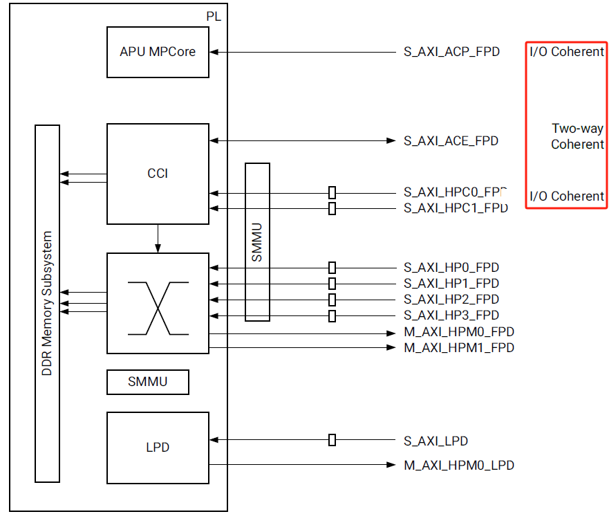
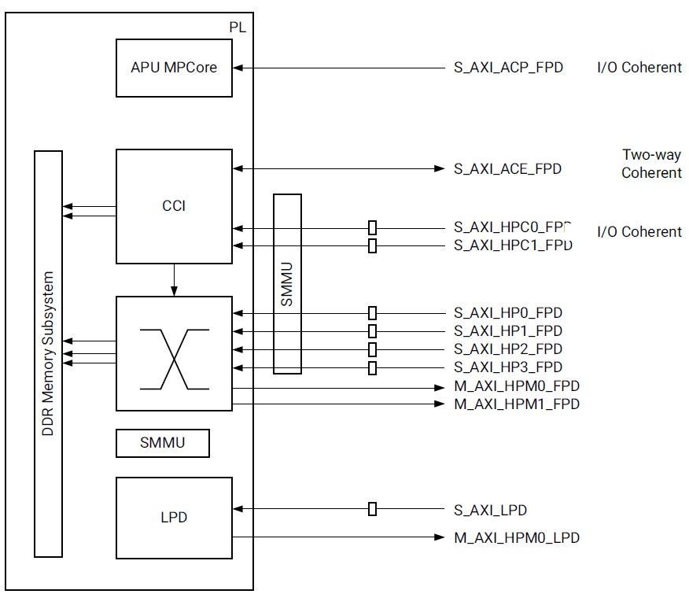

# 3-ZYNQ折腾记录-PS PL AXI Interfaces
3-ZYNQ折腾记录-PS\_PL AXI Interfaces
--------------------------------

　　Zynq UltraScale+ MPSoC集成了功能丰富的四核或双核Arm® Cortex-A53 MPCore基于处理系统(Processing System, PS)和可编程逻辑(Programmable Logic, PL)的单一设备。

　　PS和PL可以使用多个接口和其他信号进行紧密或松散的耦合。这使设计人员能够有效地将用户创建的硬件加速器和其他功能集成到PL逻辑中，这些功能对处理器可用并且还可以访问PS中的内存资源。在设计中使用Zynq UltraScale+ MPSoC，可以在PL中通过定制的应用程序实现最终产品的差异化。

​​

Cache Coherency 缓存一致性
---------------------

　　缓存一致性（Cache Coherency）是一种确保多处理器或多核系统中，各个缓存中的数据在共享内存时保持同步的机制。这在多核系统中非常重要，因为如果没有缓存一致性机制，不同处理器或核可能会在各自的缓存中看到不同的内存数据，导致数据不一致问题。

　　以下是缓存一致性的主要用途和意义：

1.  确保数据准确性：当多个处理器核访问同一块内存数据时，缓存一致性机制确保每个核读取的数据都是最新的。这避免了不同核之间的数据冲突或不一致问题，确保系统的正确性。
2.  提高性能：通过缓存一致性机制，处理器核可以放心地在本地缓存中读取和写入数据，而不必频繁地访问内存，减少了访问内存的开销，从而提高系统性能。
3.  减少编程复杂度：对开发者来说，缓存一致性机制简化了多线程编程，因为不需要手动管理和同步各核之间的数据更新。开发者可以编写简化的并发代码，而不必担心不同线程之间的缓存冲突问题。
4.  适合实时或高频交互场景：在某些应用中，如实时数据处理、视频处理、网络处理等，多个处理器核可能频繁地读写同一块内存。缓存一致性可以确保每个处理器看到的都是最新的数据，确保任务的时效性和一致性。
5.  支持共享内存的多核架构：在多核架构（如 ARM Cortex-A 系列）中，共享内存时常需要各核协同工作。缓存一致性可以使每个核使用共享内存时的数据更新不出错，特别是当核与核之间需要高速传递信息时，缓存一致性机制尤为重要。

PS-PL Interface
---------------

　　有几种类型的PS-PL AXI接口和其他PS-PL信号来支持异构处理系统。ZYNQ UltraScale+ MPSOC在PS和PL之间提供不同类型的数据路径端口。

| 接口类型 | 一致性支持 | 主要用途 | 示例应用 |
| --- | --- | --- | --- |
| AXI Coherency Extensions (ACE) | 支持  | 多核共享内存数据一致性 | 多核处理器系统 |
| Accelerator Coherency Port (ACP) | 支持  | 加速器与处理器缓存一致性 | 共享内存加速器（图像/信号处理） |
| High Performance Interface (HP) | 不支持 | 高带宽数据传输，无数据一致性需求 | 图像、信号传输和处理 |
| High Performance Coherency (HPC) | 支持  | 高带宽且数据一致性，适合协同处理应用 | 数据密集型一致性传输 |

​​
